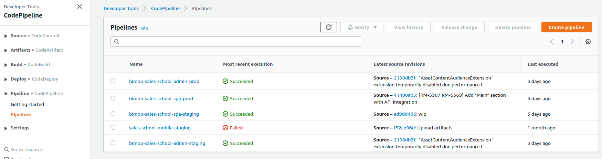
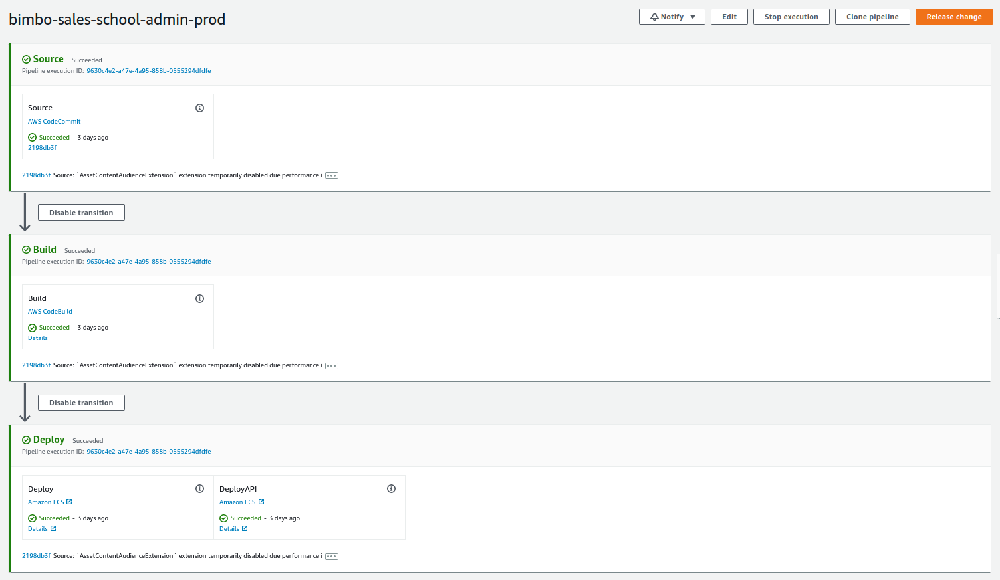
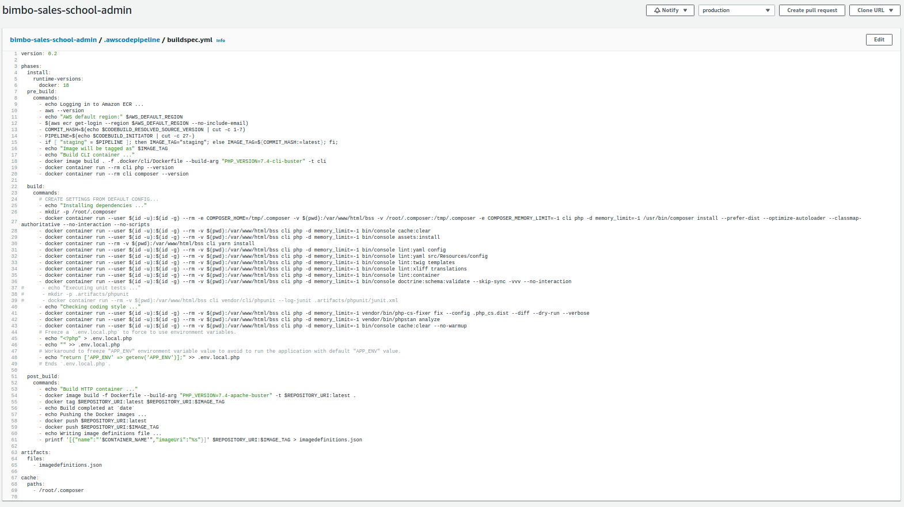
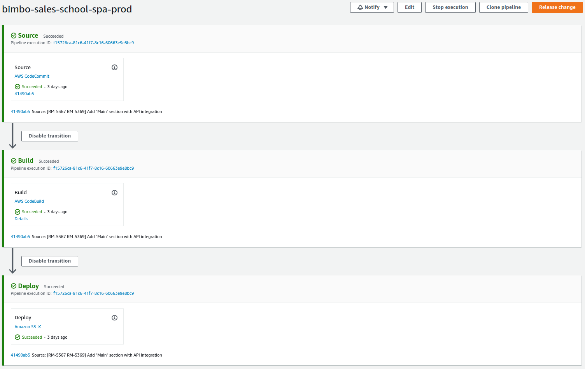
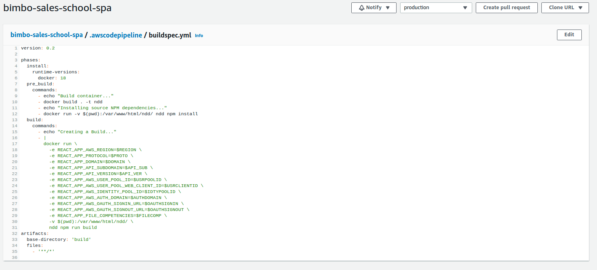
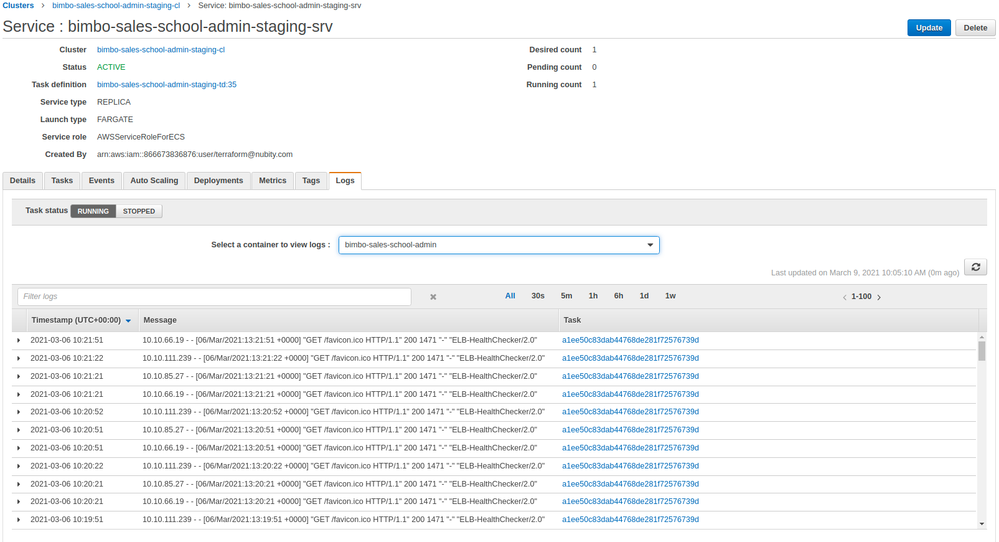

# Grupo Bimbo - Sales School

#### Dominio productivo: www.gbsalesschool.com

## Responsables:
#### [Cliente]

  - [NombrePM]
    - Puesto: PM Comercial
    - Mail: [EmailPM]

  - [NombreComercial]
    - Puesto: Comercial
    - Mail: [EmailComercial]

#### [EmpresaDesarrollo]

  - [NombrePMDesarrollo]        
    - Puesto: PM del equipo de Desarrollo
    - Mail: [EmailPMDesarrollo]

  - [NombreEncargadoEquipoDesarrollo]
    - Puesto: Equipo de Desarrollo
    - Mail: [EmailEncargadoEquipoDesarrollo]

#### Descripción:
[Descripción del cliente y a qué se dedica]

#### Infraestructura & Tecnologías

Amazon Web Services        |  Terraform
:-------------------------:|:-------------------------:
   |  

#### Accesos de Infraestructura

[Syspass](https://syspass.nubity.com)

#### Diseño de Infraestructura

#### Ambientes de Infraestructura

Los siguientes ambientes comparten el mismo diseño de infraestructura que se ve en el gráfico de arriba y la mayoria de estos recursos se encuentran replicados para cada ambiente.

- Production
- Staging

#### Git Nubity
El mismo aloja la organizacion bimbo-sales-school, dentro de esta se encuentran los repositorios de los servicios y de la infraestructura.
Si uno se ubica dentro de un servicio y sigue la ruta "servicio/.terraform/environments/production/main.tf" puede identificar que recursos de infraestructura son utilizados para dicho servicio.

#### Servicios en ECS "webprojects" Fargate

- **bimbo-sales-school-admin-prod-api-srv**
  - **Used for:** Es el SPA que sirve la aplicación, el mismo enruta las peticiones a traves API-Gateway quien se comunica con este servicio.
  - **Repo:** https://git.nubity.com/bimbo-sales-school/spa
  - **Technologies:** ReactJS 
- **bimbo-sales-school-admin-prod-srv**
  - **Used for:** Es el CMS utilizado para administrar el contenido que se muestra en la aplicación.
  - **Repo:** https://git.nubity.com/bimbo-sales-school/cms
  - **Technologies:** PHP(Sonata Framework)

#### Cargas de trabajo

- **Backend**
  - **Ubicación:** ECS Fargate
  - **Usado para:** Es la api que utiliza el frontend para traer los datos del sitio.
  - **Prod Endpoint:** admin.gbsalesschool.com
  - **Stage Endpoint:** staging.admin.gbsalesschool.com
  - **Capacidad (Prod):**
    - Tasks Auto Scaling: Minimum 1 / Maximum 3
    - Tasks Size: CPU 512 / Memory 1024
  - **Repo:** https://git.nubity.com/bimbo-sales-school/cms
  - **Lenguaje & Framework:** Nodejs / Strapi
- **Frontend**
  - **Ubicación:** Bucket S3 + Cloudfront
  - **Usado para:** Es el sitio estatico publico donde ingresan los visitantes.
  - **Prod Endpoint:** www.gbsaleschool.com
  - **Stage Endpoint:** staging.gbsalesschool.com
  - **Capacidad (Prod):**
    - Full cdn cache
  - **Repo:** https://git.nubity.com/bimbo-sales-school/spa
  - **Lenguaje & Framework:** Nodejs / Nuxt

### Backend - Información Adicional

- La API Backend es un servicio dentro de su respectivo cluster ECS, existen 2 clusters (stage, prod) uno por cada ambiente.

- Los tasks o contenedores dentro del servicio se crean a partir de una imagen base que se referencia en el Dockerfile que puede ser encontrado en el repositorio en Github o su mirror en Codecommit, el mismo se buildea en el proceso de CI/CD de AWS.

- Cada task definition para cada ambiente, contiene la misma cantidad de variables de entorno, *pero con valores diferentes*. Estas se encuentran en tiempo de ejecucion cuando una task nueva se crea.

- El ambiente productivo cuenta con *CloudWatch Container Insights* habilitado. Esta feature de CloudWatch sirve para conocer las metricas del cluster/servicio/task y es muy util para realizar un *troubleshooting* de ECS.

- No se encuentra configurado Auto Scaling para los servicios.
- ************* En ambos ambientes el servicio cuenta con su *CloudWatch Log Group*, siendo este el deposito de logs que la aplicación expone + entradas de acceso que llegan hacia el servicio. Nos sirve para tener visiblidad y poder realizar un *troubleshooting* mas certero.

### Frontend - Información Adicional

- El frontend se buildea en el pipeline generando un sitio web estático que se aloja en un bucket S3 y se consume a través de Cloudfront lo que le otorga velocidad y alta disponibilidad.

### Workflow CI/CD

Cada carga de trabajo (backend/frontend) de ambos ambientes cuentan con su propio pipeline:
 

Los pipelines para el backend cuentan con las siguientes etapas:

- **Source**
  - Codecommit
    - Branches:
      - staging
      - production
- **Build**
  - CodeBuild
    - El Dockerfile se buildea desde la definicion del archivo *.awscodepipeline/buildspec.yml* del repo.
    
- **Deploy**
  - ECS
    - ClusterName: bimbo-sales-school-admin-[staging/prod]-cl
    - FileName: imagedefinitions.json (este archivo lo genera *CodeBuild* en el stage previo)
    - ServiceName: bimbo-sales-school-admin-[staging/prod]-srv y bimbo-sales-school-admin-[staging/prod]-api-srv

Los pipelines para el frontend cuentan con las mismas estapas en los del backend, pero despliegan el contenido en un bucket de S3:

- **Source**
  - Codecommit
    - Branches:
      - staging
      - master (production)
- **Build**
  - CodeBuild
    - No se utiliza un Dockerfile dado que se buildea con una imagen oficial de AWS para Nodejs, la definicion se encuentra en el archivo *.awscodepipeline/buildspec.yml* del repo.
    
- **Deploy**
  - S3
    - BucketName: bimbo-sales-school-spa-[staging/prod]

Lo importante de los pipelines más allá de cuantos stages tengan, es el comienzo, saber que branching model o estrategia se diseñó para que ciertos eventos disparen la ejecución del pipeline. 

Para los repositorios del proyecto se cuenta con branches que hacen referencia al ambiente correspondiente (staging, production). Entonces el desarrollador al realizar una acción en **git** como **push** o **merge PR** contra alguna de estas ramas, dará comienzo a la ejecución de un pipeline puntual.

##### Troubleshooting CI/CD

En caso de que por alguna alerta o ticket generado por el cliente, se nos notifique que algun pipeline falló, lo primero que debemos hacer es ingresar a ver que cual **stage** falló. 
- **Source:** jamás falla, dado que cuando recibió el evento CloudWatch para disparar el pipeline, comenzo con este **stage**. El único que caso que podría arrojar un error, puede ser si algún Desarrollador cambia las credenciales en las cuales se vincularon en CodeStar para generar el **string connection** que realiza la integración de codepipeline, esto no sucede en este caso dado que no se realizó integración, el dev trabaja en su Github y pushea a Codecommit cuando quiere deployar.
- **Build:** puede fallar, tal vez es el mas común que haga fallar el pipeline, los motivos actuales fueron timeouts (aunque ya se expandieron dichos valores). Para saber con precisión que fase dentro del proyecto de **CodeBuild** deben ingresar al link **Details** que figura, este mismo los llevará a la ejecución fallida de **CodeBuild**, donde podrán identificar el error en las pestañas **Build Logs** / **Phase Details**

- **Deploy:** puede fallar. Si **CodeBuild** fallo previamente, este **stage** no se ejecutará.

Aquí obsevaran si el contenedor o task deployado recientemente, arroja errores.

#### Bastiones

Para que los devs puedan ingresar a la infra privada para hacer cambios en mysql o los buckets s3, se genero con terraform una instancia bastion para cada ambiente, las cuales tienen la particularidad de que tienen croneado un script que cada 15 minutos se fija si existe algun usuario conectado a la instancia, caso contrario apaga la misma para reducir costos.

Los devs ya fueron instruidos en como prender dichas instancias cuando necesitan usarlas, para esto tienen usuarios de IAM con permisos reducidos y de solo lectura que les permiten encender/apagar estas instancias, leer logs del pipeline o visualizar reportes de cloudfront, entre otras tareas de solo lectura.

#### Tareas Comunes

- [Agregar/Modificar Variables de Entorno ECS](variables_entorno_ecs.md) (Agregar nuevas variables de Entorno o Modificar cualquiera ya existente)
- [Agregar/Modificar Variables de Entorno CodeBuild](variables_entorno_codebuild.md) (Agregar nuevas variables de Entorno o Modificar cualquiera ya existente)