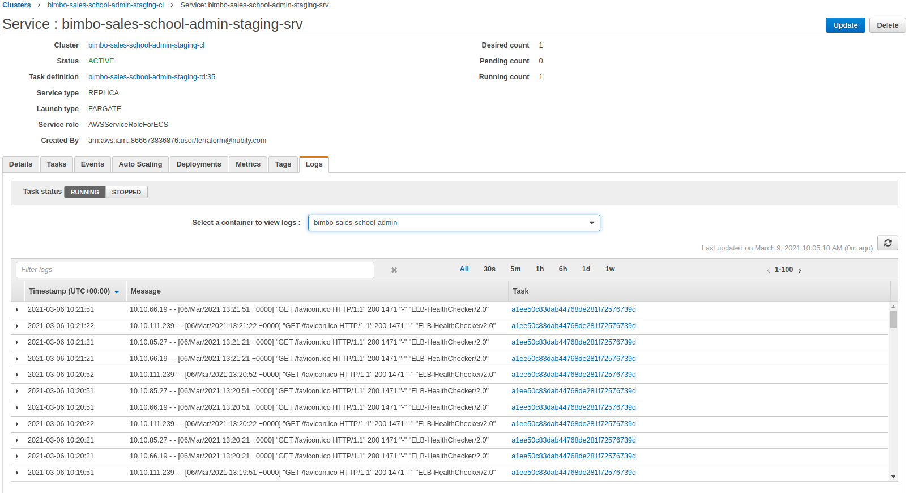

# Grupo Bimbo - Sales School
## **Índice**
1. [Descripción](#descripción)
2. [Responsables](#responsables)
3. [Infraestructura](#infraestructura)
4. [Flujo de desarrollo](#flujodedesarrollo)
5. [Integración y entrega contínua](#id5)
6. [Cargas de trabajo](#id6)
7. [Registros](#id7)
8. [Anexos y links](#id8)
## Descripción
[Descripción del proyecto y a qué se dedica. 
Información rlevada en kickoff interna y con cliente.]
## Responsables
|Nombre|Contacto|Rol|
|-|-|-|
|Mario| mario@mail.com|PM Comercial|
|Paragraph|Text||
## Infraestructura
#### Diagrama de Infraestructura

#### Accesos
Los accesos a la infraestructura de clientes, se manejan en la herramienta de [gestión de accesos](https://syspass.nubity.com) de Nubity.
* Detallar con que entrada se cargaron los mismos en syspass.
* Que tipo de acceso se utiliza, uno centralizado o uno por usuario?
* Detallar los accesos con los que se cuenta:
  * Cuenta de AWS
  * Cuenta de Github o Git Nubity
  * Cuenta de Terraform
  * Etc
* Se requiere accesder desde algun bastión?
#### Entornos
[Detallar los entornos disponibles y las particularidades de cada uno.]
* Comparten algun recurso entre los diferentes entornos?
* EL VPC es el mismo?
* Las Subnets?
* La seguridad?
* Dominios de cada parte de la aplicación, publicos y privados.
##### Production
##### Staging
##### QA
#### Infraestructura como código
[Detallar los repositorios donde esta el codigo de la infra, donde se almacena el state y cualquier particularidad que tenga que ver con el despliegue]
## Flujo de desarrollo 
[Detallar el flujo de desarrollo, fork y pr, branch y pr, cuando se taguea, cuando se hacen releases, etc.]
## Integración y entrega contínua
[Diagrmaa del pipeline de integracion continua y el flujo de desarrollo donde estan configurados los pipelines de despliegue, en que herramietna corren los mismos]
El CI/CD está configurado en AWS con los servicios de CodePipeline, CodeCommit y CodeBuild. Para almacenar imágenes de Docker se está utilizando ECR. Para desplegar el Frontend se utiliza S3 y para el backend ECS (Fargate).

#### Pipeline (CodePipeline)
Se encuentran configurados pipelines de CI/CD para Front y Back de cada ambiente:
- **Front**
  - Prod: bimbo-sales-school-spa-prod
  - Staging: bimbo-sales-school-spa-staging
- **Back**
  - Prod: bimbo-sales-school-admin-prod
  - Staging: bimbo-sales-school-admin-staging

Todos los pipelines cuentan con los mismos stages:
- Source.
- Build: 
- Deploy: tomando el BuildArtifact ejecuta el deploy en S3 o ECS dependiendo de si es Front o Back respectivamente.

#### Fuente (Source)
[Detallar donde se almacena el codigo fuente de la aplicación o de los microservicios, como se construye el arbol de dependencias, como se manejan las versiones, como es el branching model]
El código fuente se almacena en CodeCommit/GitNubity. Cada vez que se ejecuta un PR sobre la rama "staging" o "production" se lanza automáticamente el ciclo de CI/CD para el ambiente correspondiente. Este stage descarga la rama correspondiente al repositorio de CodeCommit y genera el SourceArtifact que será utilizado en el siguiente stage.
#### Construcción (Build)
[Detallar como es el proceso de consutrucción de los artifacts, imagenes docker, funciones lamnda, etc]
Este stage toma el SourceArtifact generado en Source, configura variables de entorno y basado en el buildspec.yml genera el BuildArtifact. Puede ser el archivo imagedefinitions.json (este archivo contiene la definición del contenedor e imagen de docker a utilizar) o un directorio dependiendo si se despliega en ECS (back) o S3 (front). 
Si despliega en ECS, se genera una imagen de docker y la misma es subida a ECR. Los repositorios utilizados son:
- bimbo-sales-school-admin-prod-http
- bimbo-sales-school-admin-staging-http 
#### Despliegue (Deploy)
[Detallar que herramientas se usan para despliegue y cual es la estrategia del mismo, canary, rolling update, etc.]
A continuación se detalla el despliegue para Front y Back:
- Front: el despliegue se hace en un bucket de S3. Para esto se toma el BuildArtifact generado en el stage de build y se copia todo su contenido al bucket. Los buckets de S3 utilizados son los siguientes:
  - bimbo-sales-school-spa-prod
  - bimbo-sales-school-spa-staging
- Back: el despliegue se hace en ECS. Para esto se especifica el cluster, servicio y imagedefinitions.json que se va a utilizar para hacer la actualización.
 
#### Troubleshooting
[Detallar como analizar un problema y su piosible solución en el proceso de CI/CD]
En caso de que por alguna alerta o ticket generado por el cliente, se nos notifique que algun pipeline falló, lo primero que debemos hacer es ingresar a ver que cual **stage** falló. 
- **Source:** jamás falla, dado que cuando recibió el evento CloudWatch para disparar el pipeline, comenzo con este **stage**. El único que caso que podría arrojar un error, puede ser si algún Desarrollador cambia las credenciales en las cuales se vincularon en CodeStar para generar el **string connection** que realiza la integración de codepipeline, esto no sucede en este caso dado que no se realizó integración, el dev trabaja en su Github y pushea a Codecommit cuando quiere deployar.
- **Build:** puede fallar, tal vez es el mas común que haga fallar el pipeline, los motivos actuales fueron timeouts (aunque ya se expandieron dichos valores). Para saber con precisión que fase dentro del proyecto de **CodeBuild** deben ingresar al link **Details** que figura, este mismo los llevará a la ejecución fallida de **CodeBuild**, donde podrán identificar el error en las pestañas **Build Logs** / **Phase Details**

- **Deploy:** puede fallar. Si **CodeBuild** fallo previamente, este **stage** no se ejecutará.

Aquí obsevaran si el contenedor o task deployado recientemente, arroja errores.
## Cargas de trabajo
[Detallar especificaciónes de computo y recursos para las diferentes cargas de trabajo necesarias para que la aplicación corra correctamente en todos los entornos.]
#### Registros (Logs) 
[Detallar donde se almacenan los registros de aplicación y CI/CD]
#### Anexos y links.
[Links a plataformas utilizadas, links de la aplicación, etc.]
